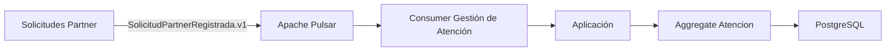

# Arquitectura del microservicio de Gestión de Atención

## 1. Responsabilidad arquitectónica

Gestión de Atención es un microservicio independiente dentro del ecosistema de Hogar de los Alpes.

Tiene su propio bounded context, su propio modelo de dominio y su propio Aggregate Root: `Atencion`.

Esto significa que:

- Gestiona su propia lógica de negocio.
- Tiene un dominio propio y cerrado.
- No comparte la base de datos con otros microservicios.
- No conoce internamente las reglas de negocio de Solicitudes Partner.
- Se enfoca en la construcción y gestión del ciclo de vida de una atención.

El microservicio no reemplaza ni extiende a Solicitudes Partner. Ambos contextos son distintos y se conectan mediante eventos e integración asincrónica.

## 2. Flujo de integración

El flujo arquitectónico esperado es el siguiente:

```text
SolicitudPartnerRegistrada.v1
        ↓
Apache Pulsar
        ↓
Consumer de Gestión de Atención
        ↓
Capa de aplicación
        ↓
Aggregate Atencion
        ↓
Persistencia propia
```

### Responsabilidad de cada componente

- `SolicitudPartnerRegistrada.v1`: evento publicado por el microservicio de Solicitudes Partner cuando registra una solicitud.
- `Apache Pulsar`: medio de transporte para la comunicación asíncrona entre microservicios.
- `Consumer de Gestión de Atención`: componente encargado de recibir el evento del broker.
- `Capa de aplicación`: valida y orquesta la operación de negocio a partir del evento recibido.
- `Aggregate Atencion`: crea o procesa la atención dentro del bounded context local.
- `Persistencia propia`: almacenamiento de la información de atención gestionada por este microservicio.

## 3. Comunicación entre microservicios

La comunicación entre microservicios será asíncrona mediante Apache Pulsar y eventos de integración.

### Para comandos/eventos

- Se utilizarán eventos de integración publicados en Apache Pulsar.
- La interacción será asíncrona.
- No se ejecutarán acciones de negocio mediante llamadas HTTP sincrónicas entre microservicios.

### Para consultas

Las consultas operativas pueden exponerse posteriormente mediante HTTP si resultan necesarias.

La diferencia es la siguiente:

- comandos y eventos → comunicación asíncrona con Pulsar
- queries → comunicación síncrona permitida mediante HTTP

Esto garantiza desacoplamiento temporal y evita que un microservicio espere una respuesta inmediata de otro para continuar su flujo de negocio.

## 4. Evento de entrada

El evento de entrada principal para este microservicio será:

`SolicitudPartnerRegistrada.v1`

### Payload V1

- `solicitud_id`
- `partner_id`
- `referencia_externa`
- `tipo_servicio`

Este evento representa la información necesaria para que Gestión de Atención construya su propio modelo de atención. El microservicio no agrega campos nuevos al contrato en este documento; consume el evento tal cual se define.

## 5. Propiedad de los datos

Gestión de Atención es propietario de su propia información de atención.

Por ejemplo, la entidad local puede poseer atributos como:

- `id_atencion`
- `solicitud_id`
- `partner_id`
- `referencia_externa`
- `tipo_servicio`
- `estado`
- `fecha_creacion`

No existe relación directa ni clave foránea con la base de datos de Solicitudes Partner. 
No se comparte la base de datos. 
No se reutiliza el almacenamiento del otro microservicio.

El diseño busca mantener la autonomía del bounded context y evitar acoplamientos de persistencia entre servicios.

## 6. Frontera entre microservicios

### Solicitudes Partner

Solicitudes Partner es responsable de:

- registrar la solicitud
- aplicar sus reglas de negocio
- determinar su resultado
- publicar el evento correspondiente

### Gestión de Atención

Gestión de Atención es responsable de:

- recibir el evento
- crear la atención
- mantener su propio estado
- gestionar el ciclo `PENDIENTE -> EN_ATENCION -> CERRADA`

### Lo que Gestión de Atención NO debe hacer

Gestión de Atención NO debe:

- consultar directamente la base de datos de Solicitudes Partner
- modificar datos de Solicitudes Partner
- duplicar reglas de negocios de Solicitudes Partner
- convertirse en una extensión del otro microservicio

La frontera debe mantenerse clara y consistente con la separación de responsabilidades entre bounded contexts.

## 7. Arquitectura interna

La estructura interna del microservicio se organiza en capas, siguiendo la convención observada en el proyecto:

```text
API
Config
Módulo Atención
    ├── Dominio
    ├── Aplicación
    └── Infraestructura
Seedwork
```

### API

Capa de entrada para la interacción externa del microservicio.

### Config

Configuración del servicio, entorno y componentes del sistema.

### Módulo Atención

Contiene la lógica del bounded context correspondiente a la atención.

#### Dominio

Define el Aggregate Root, los Value Objects, las reglas de transición y la validación de integridad.

#### Aplicación

Coordina casos de uso, orquesta la decisión de negocio y prepara la ejecución del dominio.

#### Infraestructura

Mantiene el soporte técnico para persistencia, mensajería y adaptadores. Aún no se implementa en esta etapa.

### Seedwork

Contiene conceptos reutilizables y genéricos que puedan ser compartidos por el microservicio, sin mezclar reglas del dominio específico de atención.

## 8. Flujo de procesamiento del evento

El flujo conceptual de procesamiento es el siguiente:

```text
Pulsar
 ↓
Consumer
 ↓
Deserialización del evento
 ↓
Caso de uso / aplicación
 ↓
Creación de Atencion
 ↓
Persistencia
 ↓
ACK del mensaje
```

### Importante sobre el ACK

El `ACK` debe ocurrir después de que la operación haya sido procesada correctamente y persistida.

Si el procesamiento falla antes del ACK, el mensaje debe poder ser reprocesado según la estrategia de mensajería que se defina posteriormente.

Esto es un requisito arquitectónico importante, pero en esta etapa no se implementa la lógica concreta.

## 9. Idempotencia

Los eventos pueden ser entregados más de una vez. Por ese motivo, la idempotencia es un tema de infraestructura y aplicación, no del Aggregate.

El diseño propuesto establece que:

- la idempotencia NO pertenece al Aggregate
- la deduplicación será responsabilidad de aplicación e infraestructura
- posteriormente podrán utilizarse mecanismos como `event_id` o una restricción única sobre `solicitud_id`

No se implementa en esta etapa.

## 10. Resiliencia

La comunicación asincrónica permite que el sistema resista caídas temporales del consumidor.

El comportamiento esperado es el siguiente:

```text
SolicitudPartner
      ↓
Pulsar
      ↓
[mensajes pendientes]
      ↓
Gestión de Atención vuelve
      ↓
Consumer procesa
```

Esto significa que la caída temporal de Gestión de Atención no obliga a Solicitudes Partner a esperar una respuesta síncrona.

La resiliencia de la arquitectura es clave para escenarios futuros de entrega y continuidad del sistema.

## 11. Escalabilidad

Gestión de Atención podrá escalar horizontalmente a través de múltiples instancias del consumer utilizando una suscripción compartida de Apache Pulsar.

```text
             Pulsar
                │
       ┌────────┼────────┐
       ↓        ↓        ↓
   Consumer  Consumer  Consumer
      1          2         3
```

Las distintas instancias comparten la carga de mensajes. La métrica de lag de consumidores se convertirá en una señal útil para escalar el servicio en etapas posteriores.

No se implementa autoscaling en esta etapa.

## 12. Persistencia

La decisión arquitectónica es que Gestión de Atención tendrá su propia base de datos.

Esto implica:

- autonomía del microservicio
- independencia frente a otros contextos
- persistencia específica del propio modelo de atención

No se comparte la base de datos con otros microservicios.

La persistencia será implementada posteriormente, pero no se implementa PostgreSQL todavía.

## 13. Diagrama conceptual



Este diagrama deja clara la comunicación asíncrona entre microservicios y la propiedad local de la información de atención.

## 14. Relación con los escenarios de calidad

La arquitectura propuesta favorece los siguientes escenarios de calidad:

- Extensibilidad: evolución del contrato del evento
- Escalabilidad: múltiples consumidores y carga compartida en Pulsar
- Resiliencia: mensajes pendientes mientras el microservicio está caído

No se diseñan pruebas en este documento; solo se explicita qué patrón arquitectónico habilita cada escenario.

## 15. Decisiones y trade-offs

### Pulsar

Ventaja:
- desacoplamiento temporal y espacial
- permite absorción de picos
- permite múltiples consumidores

Trade-off:
- mayor complejidad operacional que una comunicación HTTP síncrona

### Base de datos propia

Ventaja:
- autonomía del microservicio
- independencia de evolución del modelo local

Trade-off:
- consistencia eventual
- posible duplicación de datos necesarios para operación

### Comunicación asíncrona

Ventaja:
- resiliencia
- desacoplamiento
- escalabilidad

Trade-off:
- procesamiento eventual
- necesidad de idempotencia
- mayor complejidad de observabilidad

## 16. Fuera de alcance

Este documento no incluye ni define:

- Saga
- BFF
- API completa
- implementación de Pulsar
- implementación de Avro
- PostgreSQL
- autoscaling real
- DLQ
- retries técnicos detallados
- observabilidad avanzada

Esos temas quedarán para etapas posteriores y no forman parte de la arquitectura mínima documentada aquí.

## 17. Importante

No se deben inventar decisiones técnicas que todavía no hayan sido aprobadas.

En particular, no se decide todavía:

- nombre definitivo del topic
- estructura definitiva del schema Avro
- estrategia definitiva de DLQ
- número de particiones
- número de réplicas
- configuración de BookKeeper
- parámetros de autoscaling

Estos asuntos serán tratados en pasos posteriores.

## 18. Conclusión

La arquitectura de Gestión de Atención se define como un microservicio autónomo, con su propio bounded context y su modelo mínimo de atención.

La intención arquitectónica es mantener un diseño desacoplado, resiliente y extensible, en el que el evento `SolicitudPartnerRegistrada.v1` sea el punto de entrada para la creación de la atención y la base para futuras fases de integración event-driven.

En esta etapa, el documento se centra en la definición de la frontera, los contratos de integración y la forma esperada de evolucionar sin introducir infraestructura ni implementación concreta todavía.

## Validación

Se valida que:

1. se creó el contenido solicitado en `docs/02-arquitectura-microservicio.md`
2. la estructura de `docs/` quedó consistente con el proyecto
3. no se modificó código
4. no se modificó `solicitud-partner`
5. el documento 02 es consistente con el documento 01

Detenerse aquí después de la validación documental.
